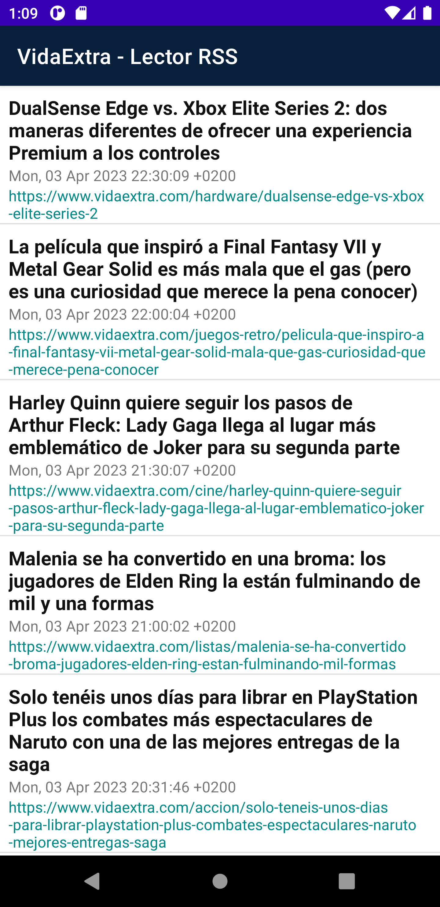

<b>- SPANISH -</b>  

# Lector de RSS para VidaExtra en Kotlin

Lector de RSS muy sencillo para el blog de videojuegos VidaExtra escrito en Kotlin para Android. Con este lector, puedes estar al día de las últimas noticias, reseñas y artículos de opinión publicados en VidaExtra.

## Cómo usar

Para usar este lector de RSS, simplemente descarga el código y ejecútalo en tu dispositivo Android. Asegúrate de tener las dependencias necesarias instaladas antes de compilar y ejecutar el proyecto.

## Dependencias

Este lector de RSS utiliza las siguientes dependencias:

- kotlinx.coroutines:core:1.5.1
- androidx.lifecycle:lifecycle-runtime-ktx:2.3.1

## Captura de pantalla

A continuación, se muestra una captura de pantalla del lector de RSS en acción:

<b>- ENGLISH -</b>  

# RSS Reader for VidaExtra in Kotlin

This is a very simple RSS reader for the VidaExtra video game blog written in Kotlin for Android. With this reader, you can stay up-to-date with the latest news, reviews, and opinion articles published on VidaExtra.

## How to use

To use this RSS reader, simply download the code and run it on your Android device. Make sure you have the necessary dependencies installed before compiling and running the project.

## Dependencies

This RSS reader uses the following dependencies:

- kotlinx.coroutines:core:1.5.1
- androidx.lifecycle:lifecycle-runtime-ktx:2.3.1

## Screenshot

Below is a screenshot of the RSS reader in action:

